# Glazyr Chrome Extension

Vision-first AI assistant for web browsing (Chrome Extension, Manifest V3).

## Architecture

```mermaid
flowchart TB
    subgraph Browser["🌐 Browser Tab"]
        User[👤 User]
        Webpage[📄 Webpage]
        WidgetUI["🎨 Widget UI<br/>(popup.html)<br/>Splash Video Animation"]
    end

    subgraph Extension["🔌 Chrome Extension"]
        ContentScripts["📜 Content Scripts<br/>(content.js, widget_content.js)<br/>• Page context capture<br/>• Action execution<br/>• Widget injection"]
        ServiceWorker["⚙️ Service Worker<br/>(background.js)<br/>• Safety policy enforcement<br/>• Orchestration<br/>• API communication"]
        ChromeStorage[💾 Chrome Storage<br/>• Runtime config<br/>• Page context buffer<br/>• Safety policy]
    end

    subgraph Runtimes["☁️ External Runtimes"]
        VisionRuntime["👁️ Vision Runtime<br/>(AWS Lambda)<br/>POST /runtime/vision/analyze<br/>POST /runtime/vision/ocr"]
        McpRuntime["🤖 MCP Runtime<br/>(LangChain Agents)<br/>GET /mcp/manifest<br/>POST /mcp/invoke<br/>GET /api/tasks/{id}"]
    end

    User -->|"1. Ask question"| WidgetUI
    WidgetUI -->|"2. Send query"| ServiceWorker
    ServiceWorker -->|"3. Request context<br/>(wait 2s delay)"| ContentScripts
    ContentScripts -->|"4. Capture page<br/>(URL, title, text)"| Webpage
    ContentScripts -->|"5. Page context"| ServiceWorker
    
    ServiceWorker -->|"6a. Screenshot/OCR<br/>(explicit capture)"| VisionRuntime
    VisionRuntime -->|"7a. Derived text<br/>(OCR, labels)"| ServiceWorker
    
    ServiceWorker -->|"6b. All queries<br/>(derived text context)"| McpRuntime
    McpRuntime -->|"7b. AI response"| ServiceWorker
    ServiceWorker -->|"8. Display response"| WidgetUI
    WidgetUI -->|"9. Show to user"| User

    ServiceWorker <-->|"Read/Write<br/>Safety policy<br/>Runtime config"| ChromeStorage
    ChromeStorage -->|"Policy enforcement"| ContentScripts

    style User fill:#e1f5ff
    style WidgetUI fill:#fff4e1
    style ServiceWorker fill:#ffe1f5
    style VisionRuntime fill:#e1ffe1
    style McpRuntime fill:#f5e1ff
    style ChromeStorage fill:#ffe1e1
```



### Architecture Overview

The Glazyr Chrome Extension follows a **local-first, dual-runtime architecture**:

**Extension Components:**
- **Content Scripts**: Injected into web pages to capture context (URL, title, text) and execute actions. Includes widget injection and page interaction capabilities.
- **Service Worker**: Central orchestrator that enforces safety policies, manages API communication, and coordinates between components.
- **Widget UI**: User-facing interface (popup/widget) that displays chat, shows splash video animations during loading, and handles user input.

**External Runtimes:**
- **Vision Runtime (AWS)**: Handles OCR and image analysis. Receives screenshots only when explicitly captured by the user.
- **MCP Runtime (LangChain)**: Processes all natural language queries using AI agent orchestration. Receives derived text context (not raw screenshots) for privacy and efficiency.

**Key Data Flows:**
1. **Query Flow**: User asks question → Widget UI → Service Worker → MCP Runtime → AI response → Widget UI
2. **Context Capture**: Service Worker requests page context (with 2s delay for page loading) → Content Scripts capture → Service Worker buffers locally
3. **Screenshot Flow**: User captures screenshot → Vision Runtime → OCR/analysis → Derived text → Service Worker
4. **Safety Policy**: Chrome Storage → Service Worker → Content Scripts (enforcement)

**Privacy & Security:**
- All data stored locally in Chrome Storage
- Only derived text (not raw screenshots) sent to MCP Runtime
- Screenshots only sent to Vision Runtime when explicitly captured
- Safety policies enforced locally before any action execution

## Install (Load Unpacked)

1. Open `chrome://extensions/`
2. Enable **Developer mode** (top-right)
3. Click **Load unpacked**
4. Select the `dist/` folder

## What's in this repo

- **`dist/`**: the packaged extension Chrome loads (service worker, content scripts, popup, manifest, icons).
- **`tools/`**: helper scripts (icon resizing, packaging).

## Permissions

This extension requests:

- **`<all_urls>` host permission**: so content scripts can run on pages you visit.
- **`activeTab`, `scripting`**: to interact with the current page when you invoke the extension.
- **`storage`**: to persist settings/state.
- **`tabs`, `webNavigation`**: to read basic tab/navigation context needed for the browsing assistant.

See `dist/manifest.json` for the authoritative list.

## Safety enforcement (important)

Safety config is loaded from `chrome.storage.local` (written by the control plane) and enforced in multiple places:

- **Kill switch** blocks capture + action execution.
- **Agent mode**:
  - `observe` blocks click/type/navigate/submit
- **Allowed domains + disallowed actions** gate capture + actions.

The extension also reports enforcement signals back to the control plane in its status heartbeat.

## Runtime integrations

### MCP runtime (glazyr-control) — agent orchestration

**All natural language queries are routed through the LangChain MCP runtime by default.** The extension calls an MCP-native runtime for agent reasoning/orchestration:

- `GET /mcp/manifest` - Get available tools and schemas
- `POST /mcp/invoke` (tool: `agent_executor`, arguments: `{ query: "..." }`)
- Optional monitoring:
  - `GET /api/tasks?limit=...`
  - `GET /api/tasks/{task_id}`

The extension sends **derived text context** (page excerpt + OCR/caption/labels text) to the MCP runtime — not raw screenshots unless explicitly needed.

**Query routing:**
- Natural language queries (e.g., "whats this page about", "give me a summary") → Automatically routed to LangChain MCP
- `/mcp <query>` → Explicitly calls LangChain MCP (same as natural language)
- `/runtime url <url>` → Configure MCP runtime URL
- `/runtime key <key>` → Configure MCP runtime API key
- `/mcp/manifest` → Show available MCP tools

**Page context loading:**
- The extension waits ~2 seconds for pages to finish loading before capturing context
- A splash video animation plays in the widget header during loading
- Extension icon shows an hourglass badge (⏳) while waiting

### Vision runtime (AWS) — OCR/vision

Screenshot capture and OCR/vision analysis remains on the Vision runtime endpoints (example):

- `POST /runtime/vision/analyze`
- `POST /runtime/vision/ocr` (fallback)

### Runtime configuration keys

Runtime endpoint/auth can be configured via `chrome.storage.local` or via chat commands:

**Via chat commands (recommended):**
- `/runtime url <base-url>` - Set MCP runtime URL (e.g., `https://langchain-agent-mcp-server-554655392699.us-central1.run.app`)
- `/runtime key <api-key>` - Set MCP runtime API key (optional)
- `/runtime show` - Display current runtime configuration

**Via storage keys:**
- **MCP runtime**
  - `glazyrMcpRuntimeBaseUrl`: base URL (no trailing slash, defaults to hardcoded LangChain agents MCP URL)
  - `glazyrMcpRuntimeApiKey`: optional API key (sent as `x-glazyr-api-key` or `Authorization: Bearer ...`)
- **Vision runtime**
  - `glazyrRuntimeBaseUrl`: Function URL base (no trailing slash)
  - `glazyrRuntimeApiKey`: optional API key (sent as `x-glazyr-api-key`)
- `glazyrDeviceId`: generated automatically if missing

> The current build has a default LangChain agents MCP URL hardcoded in `dist/background.js` for ease of use.

## Image handling features

- **Framed screenshot (crop capture) + OCR (working POC)**: capture a selected region and run Google Vision OCR via the AWS runtime (`POST /runtime/vision/ocr`).
- **Drag-and-drop analysis**: drag an image file or an image element onto the page to send it to the background (currently still a stub/mock beyond OCR).

### Widget UX (current POC)

- OCR prints into the **chat** (assistant message), not a dedicated OCR panel.
- The widget does **not** render the screenshot image (it's already visible on the page).
- A draggable **in-page Glazyr logo launcher** toggles the widget.
- **Splash video animation** plays in the header while waiting for page context to load (mobile/desktop variants).
- **Extension icon badge** shows hourglass (⏳) during page context loading.

## How to use Glazyr

### Natural language queries

1. Open any webpage.
2. Click the in-page **Glazyr logo launcher** to open the widget (or click the extension icon).
3. Ask a question in natural language (e.g., "whats this page about", "give me a summary").
4. The extension will:
   - Wait for the page to finish loading (~2 seconds)
   - Show a splash video animation while waiting
   - Capture fresh page context
   - Send the query to LangChain MCP for processing
   - Display the AI response in the chat

### Taking a "framed screenshot" (crop capture)

1. Open any webpage.
2. Click the in-page **Glazyr logo launcher** to open the widget (or click the extension icon).
3. Click **Framed shot**.
4. Select an area, release to capture.

Alternative (via text query in the popup): type **"framed screenshot"** (or **"crop capture"**) and submit.

## Runtime requirements for OCR

- Provision the AWS runtime: see `../runtime-aws/README.md`
- Enable **billing** on the GCP project and enable the **Cloud Vision API**

## Update the extension logo (icons)

Source image:

- `Mechanical eye with blue iris.png`

Generate required icon sizes (16/48/128):

```powershell
powershell -NoProfile -ExecutionPolicy Bypass -File tools/resize-icons.ps1
```

This overwrites:

- `dist/icons/icon16.png`
- `dist/icons/icon48.png`
- `dist/icons/icon128.png`

## Package a ZIP for GitHub Releases / sharing

Create a versioned ZIP (uses version in `dist/manifest.json`):

```powershell
powershell -NoProfile -ExecutionPolicy Bypass -File tools/package-extension.ps1
```

Output:

- `release/glazyr-chrome-extension-v<version>.zip`

## Architecture Diagram Image Generation

The architecture diagram above is rendered as a Mermaid flowchart. To generate a static image file (PNG/SVG) from the diagram:

### Option 1: Mermaid CLI (Recommended)

```bash
# Install Mermaid CLI
npm install -g @mermaid-js/mermaid-cli

# Generate PNG from README.md
mmdc -i README.md -o architecture-diagram.png -b transparent

# Generate SVG
mmdc -i README.md -o architecture-diagram.svg -b transparent
```

### Option 2: Online Mermaid Editor

1. Visit [Mermaid Live Editor](https://mermaid.live/)
2. Copy the Mermaid code from the Architecture section above
3. Export as PNG or SVG

### Option 3: VS Code Extension

1. Install the "Markdown Preview Mermaid Support" extension
2. Open README.md in VS Code
3. Right-click the diagram → Export as image

The generated image can be used for documentation, presentations, or replacing the old screenshot reference if needed.
